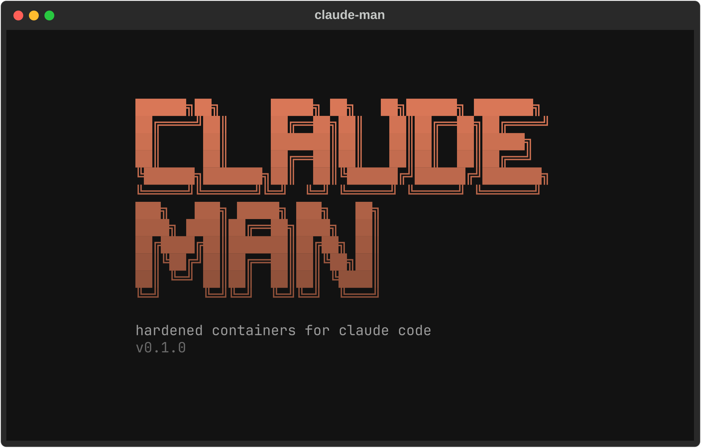
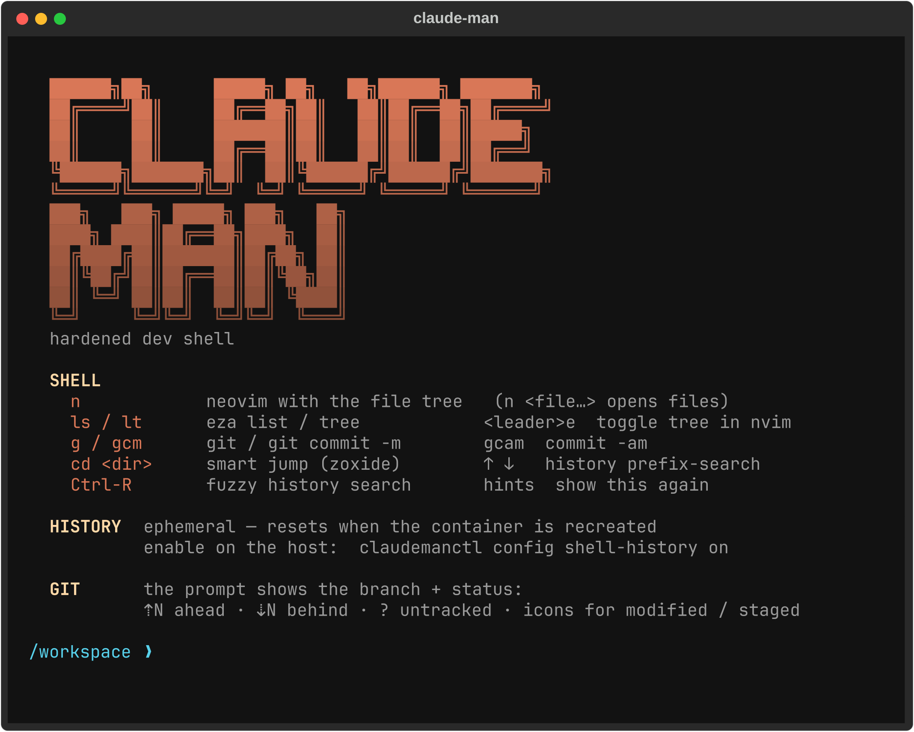

# claude-man

<p align="center">
  
</p>

A Python **Textual TUI** + a scriptable **`claudemanctl`** CLI that provisions, persists, and
manages **hardened Docker containers**, each running **Claude Code** under a chosen **account
profile** (e.g. work / home), for a set of long-lived **git-checkout projects** on a single
host. Each container is a **working hardened dev environment** — a curated shell and editor you
can work in alongside the agent, not just a box the agent runs in.

It exists to solve seven things at once:

1. **Multiple accounts** — launch each Claude instance under a chosen profile. A profile is one
   OAuth identity minted once with `claude setup-token` and injected per-launch as
   `CLAUDE_CODE_OAUTH_TOKEN`. Each project picks a profile (or inherits the default).
2. **Persistent projects** — a project is a named set of git repos checked out once and kept
   across container restarts and host reboots **until you explicitly delete it**. The manager
   shows the live state, profile, egress mode, and version of every project.
3. **Secure sandbox** — every project runs in its own hardened container (read-only rootfs,
   all capabilities dropped, no-new-privileges, non-root, pid-limited, **hard memory-capped** —
   `16g` by default, `config memory` to change), loadable with project environment variables and
   extra software via image overlays. Egress is open by default and **lockable** to a strict
   per-project allowlist.
4. **Curated packs** — an in-repo library of guidance templates (focused `CLAUDE.md` fragments +
   skills, bundled as **packs**: guardrails, code-quality, per-language conventions) that
   projects opt into. Selections materialize into each project's config automatically, so house
   rules are versioned, reviewed, and improved in **one place** instead of drifting per project.
5. **Config sync-back** — when you close a session, changes the agent made to its Claude config
   (agents, skills, slash-commands, `settings.json`, MCP servers) are diffed against a baseline
   and offered back to your host config behind an **accept/reject gate**. Credentials and
   identity are **never** synced.
6. **A working dev environment** — every container is also a curated **hardened dev shell** you
   (not just the agent) work in: a starship git-aware prompt, prefix + fuzzy (`Ctrl-R`) history
   search, the `n` neovim shortcut (file tree on open), and `eza`/`zoxide`/`fzf`/`bat` — plus a
   baked neovim with LSP/treesitter. A shell-open banner sums up the keys; bash history is
   ephemeral by default and persistable with the opt-in `config shell-history`. All baked
   read-only — the hardened floor is unchanged.
7. **Hybrid local models** — pin a self-hosted model (via host **[Ollama](https://ollama.com)**) to a
   project and it joins Claude Code's `/model` picker **alongside** your claude.ai subscription,
   switchable mid-session. A per-project **LiteLLM gateway sidecar** fronts both legs on one endpoint:
   the built-in Claude tiers pass through to Anthropic so your **Max/Pro subscription stays the active
   credential** (no API key is ever injected — invariant 1 holds, never mis-billed), while the local
   model routes to your GPU. claude-man installs/updates/inspects the models (`model add/list`, curated
   coding-model presets); you run the Ollama daemon. See [`docs/MODELS.md`](docs/MODELS.md).

<p align="center">
  
</p>

> Status: **alpha** (2026-08-21). Working today, from both the TUI and the CLI: multi-account
> profiles; hardened per-project containers with the full lifecycle; live repo state; ssh/file/env
> mounts; published ports; strict-egress lockdown; curated packs; review-gated config sync-back;
> the baked dev shell + neovim; hybrid local models (subscription passthrough verified live); and
> a first-run **setup wizard** + `claudemanctl doctor` host checks. 800+ dependency-free tests;
> the hardened image is `image smoke`-gated. See [`ROADMAP.md`](ROADMAP.md) for what's next.

## What it protects against

claude-man's containment is a **headline feature**, not a side effect. The 2026 wave of
supply-chain attacks on AI coding agents — poisoned npm/PyPI packages whose install hooks steal
`~/.claude/.credentials.json`, GitHub/cloud/SSH keys; malicious skills/agents that run shell
commands without approval; `~/.claude.json` rewrites that redirect your OAuth token to an
attacker; `rm -rf ~/` trip-wires; `-setup.pth` startup-hook persistence — all assume **the agent,
its config, and your credentials share one host filesystem**. Running Claude Code inside a
hardened, per-project container breaks that assumption by construction. The point isn't to stop a
compromised package from *installing* — `npm install` still runs its hooks — it's to ensure the
blast radius is **one disposable container**, not your machine.

| Attack technique (real 2026 TTPs) | What claude-man does |
|---|---|
| **Steal `~/.claude/.credentials.json`** | Your **host** file is never in any container. Token mode (default): auth is an env-var OAuth token — no credentials file exists inside at all. Opt-in **login mode** (for claude.ai connectors): a per-project credential *minted inside* the container lives only in that project's own bind — one disposable sandbox, never synced back, `project logout` removes it (invariant 1). |
| **Harvest SSH private keys** | Keys **never enter the container**: only the host ssh-agent *socket* is forwarded, so a payload can't exfiltrate a key (it can sign while connected — a documented residual). |
| **Poison host `~/.claude/settings.json` hooks** | The per-project `~/.claude` is seeded from a **filtered allowlist with hooks/statusLine stripped**; there is no path for a poisoned host hook to ride into the container, nor for a container-written hook to reach the host unreviewed. |
| **`rm -rf ~/` destructive trip-wire** | `~` is `/home/agent` inside the sandbox — the wiper can only touch the re-seedable per-project config and a tmpfs. **The host home is untouched.** |
| **`-setup.pth` / daemon persistence** | The rootfs is **read-only** (`--read-only`), capabilities are **all dropped** (`--cap-drop ALL`), `no-new-privileges`, non-root, pid-limited. Image-level persistence is impossible; anything in a `/workspace` venv dies on recreate. |
| **Memory bomb / runaway build starves the host** | Every container carries a **hard memory cap** (`--memory X --memory-swap X`, `16g` default — no swap spill). A runaway is OOM-killed **inside its own cgroup**; the host desktop never sees memory pressure. |
| **Malicious skill runs `Bash(*)` / reverse shell** | The command still runs — but **inside** the sandbox: no host reach, and the reverse shell needs egress + tooling the minimal base image doesn't ship. Under **strict egress** the connection is refused outright. |
| **Exfiltrate secrets / redirect OAuth token to attacker infra** | **Strict egress** routes every connection through an allowlisting proxy on a no-direct-route network — the token and any env secrets can only reach Anthropic/allowlisted hosts, never an attacker endpoint. |
| **Steal the host GitHub PAT during clone** | Repos are cloned **host-side** with the PAT masked; the host git PAT **never enters the container**. |

**Strict egress** — the lockable network boundary — is the single biggest lever against the
*exfiltration* and *command-and-control* steps nearly every one of these attacks depends on:
the agent runs on an `internal` Docker network with no direct route out, and a squid proxy
sidecar (CONNECT tunnels, no MITM) is the only path to the internet, enforcing a per-project
domain allowlist with every denial logged. See [`docs/SECURITY.md`](docs/SECURITY.md) for the
full threat model and [`CLAUDE.md`](CLAUDE.md) for the load-bearing invariants.

## How it fits together

```
~/.config/claude-man/         durable, secret-free definitions (git-versionable)
  profiles/<name>.toml          one account identity (display name, email, default flag)
  projects/<slug>.toml          a project EXISTS iff this file exists
  assets/<slug>/                per-project asset source (CLAUDE.md, skills) — synced into the
                                binds on start; curated packs materialize here

~/.local/state/claude-man/    durable runtime state (some secret; never committed)
  profiles/<name>/token         0600 long-lived OAuth token (from `claude setup-token`)
  profiles/<name>/identity.json scrubbed oauthAccount block (no UUIDs)
  profiles/<name>/seed/         allowlisted ~/.claude assets new projects inherit
  projects/<slug>/workspace/    the checked-out repos  ->  bind /workspace
  projects/<slug>/workspace/scratch/  data drop-zone -> /workspace/scratch (wiped on start+stop)
  projects/<slug>/claude-config/ per-project CLAUDE_CONFIG_DIR  ->  bind /home/agent/.claude
  projects/<slug>/packs-manifest.json  which files the pack system manages (ours/theirs boundary)
  sync-audit/                   git repo: per-session commit of accepted sync-back

<the claude-man checkout>/    the install is the clone
  library/packs/<tier>/<pack>/  the curated pack library (versioned with the code)

docker                        the live status oracle
  one named container per project: claude-man-<slug>, labelled claude-man.*
```

Both roots default to `$XDG_CONFIG_HOME` / `$XDG_STATE_HOME` (falling back to `~/.config` /
`~/.local/state`), and can be relocated wholesale with the `CLAUDE_MAN_CONFIG_HOME` /
`CLAUDE_MAN_STATE_HOME` env overrides. The TOML registry answers *what a project is*; `docker ps`
(queried fresh, never cached) answers *what state its container is in right now*. On any
divergence the **registry wins** and the container is recreated.

## Prerequisites

Four things need to be on the host **before** claude-man is useful. `claudemanctl doctor` checks
them all (and the TUI's first-run wizard walks you through fixing them):

1. **Docker** — the container runtime everything runs in.
   - *Linux* (the reference platform): [Docker Engine](https://docs.docker.com/engine/install/),
     rootful, daemon running (`sudo systemctl enable --now docker`). Add yourself to the docker
     group so claude-man can talk to it without sudo: `sudo usermod -aG docker $USER`, then log
     out and back in.
   - *macOS*: [Docker Desktop](https://docs.docker.com/desktop/).
   - *Windows*: WSL2 only — Docker Desktop's WSL backend, or docker-ce inside the distro. See
     *Platform support* below.
   - Verify: `docker version` shows a server version without errors.
2. **Claude Code on the host** — needed once per account to mint profile tokens
   (`claude setup-token`); the in-container claude is baked into the image and doesn't use the
   host install. Install: [claude.com/claude-code](https://claude.com/claude-code).
3. **A terminal emulator** — project shells/claude/editor open in detached terminal windows.
   Auto-detected: `ghostty`, `alacritty`, `kitty`, `wezterm`, `foot`, `ptyxis` (GNOME's default
   on Ubuntu 25.10+/Fedora), `gnome-terminal`, `konsole`, `xterm` on Linux; Terminal.app works
   with nothing extra on macOS; Windows Terminal on WSL2. Anything else works via a custom
   launcher template — the setup wizard / Settings picker configures it.
4. **Python ≥ 3.11 and [`uv`](https://docs.astral.sh/uv/)** — to install and run claude-man
   itself.

```bash
uv run claudemanctl doctor    # checks all of the above, with a fix hint per problem
```

## Install

Not on PyPI yet, but the wheel is **self-contained** — the Dockerfiles, image assets, and the curated
pack library are bundled into it, so an installed copy works with no source checkout.

**As a tool** (a `claudemanctl` / `claudeman` on your PATH):

```bash
git clone https://github.com/richardjr/claude-man.git && cd claude-man
uv build                                 # -> dist/claude_man-<ver>-py3-none-any.whl
uv tool install dist/*.whl               # or: pipx install dist/*.whl
```

**From a checkout** (for development / hacking on claude-man itself):

```bash
git clone https://github.com/richardjr/claude-man.git
cd claude-man
uv sync          # installs textual + tomlkit into .venv
uv run claudeman --help
```

Either way, runtime state lives outside the install, under `~/.config/claude-man` and
`~/.local/state/claude-man`.

## Getting started (TUI)

```bash
uv run claudeman          # (or just `claudeman` after a wheel install)
```

On a completely fresh machine the TUI opens with the **setup wizard**. It runs the same checks as
`claudemanctl doctor` and then walks through the one-time host setup, every step skippable:

1. **System check** — docker (binary, daemon, socket permission — each failure shows its exact
   fix, e.g. the `usermod -aG docker` line), the host claude CLI, the hardened image, your
   terminal.
2. **Terminal** — confirms the auto-detected terminal for project windows, or opens the picker;
   pick `custom` to define a launcher template for a terminal that isn't in the built-in table.
3. **Account profile** — creates your first profile inline: the TUI pauses back to your
   terminal, `claude setup-token` opens the browser, you paste the token, and the TUI resumes.
4. **Base image** — optionally builds the hardened image now with streamed progress (it
   otherwise builds automatically on your first project create).

The wizard only auto-appears on a fresh machine; re-run it any time from Settings — press `,`
then `w`.

From the main screen:

- **`n`** creates your first **project** — name it, pick the account profile, an image overlay
  (base / python / node / rust / …), a pack language, and the egress mode. The container is
  created and the hardened image built automatically if needed.
- With the project row selected: **`s`** starts/stops it, **`Enter`** opens a shell inside,
  **`c`** opens **claude**, **`e`** the baked neovim, **`b`** the workspace in your file manager.
- **`g`** manages the project's git repos (add a repo URL — it's cloned host-side into
  `/workspace`), **`p`** opens the Project menu (env mounts, ports, packs, egress lock, model
  pin, profile switch, recreate, delete), **`,`** opens Settings.
- The bottom key bar lists everything; every failure surfaces in the log pane and as a toast.

If something misbehaves, `claudemanctl doctor` from any shell re-checks the host with fix hints.
The full tour with screenshots of every screen is [`docs/TUI-GUIDE.md`](docs/TUI-GUIDE.md), and
ready-made per-stack recipes (Node, Python, Rust, Terraform+AWS, lockdown, local models) are in
[`docs/SETUP-GUIDES.md`](docs/SETUP-GUIDES.md).

## Platform support

| Host | Status | Notes |
|---|---|---|
| **Linux** | ✅ supported | The reference platform (developed against Docker 29.x). |
| **macOS** | ✅ supported | Docker Desktop runs the same Linux image; ssh-agent forwarding uses Docker Desktop's built-in default-agent socket; Terminal.app works out of the box (iTerm2/kitty/alacritty/wezterm too). |
| **Windows** | ✅ via **WSL2** only | Run claude-man *inside* a WSL2 distro (with Docker Desktop's WSL backend or docker-ce in the distro) — there it *is* Linux. Windows Terminal (`wt`) and `explorer.exe`/`wslview` are auto-detected for spawned windows / Browse. **Native Windows is out of scope.** |

The container side is identical everywhere: the image is Linux regardless of host, so the hardened
profile never varies. On macOS, note that bind-mount I/O (VirtioFS) is slower than native Linux —
large `yarn`/`npm` installs in `/workspace` take noticeably longer.

## Going further

| Doc | What's in it |
|---|---|
| [`docs/CLI.md`](docs/CLI.md) | **The full `claudemanctl` reference** (power users / scripting): profiles, projects, repos, env mounts, ports, packs, egress, sync-back, models, images, all config verbs. |
| [`docs/TUI-GUIDE.md`](docs/TUI-GUIDE.md) | The detailed TUI walkthrough — every screen and keybinding. |
| [`docs/SETUP-GUIDES.md`](docs/SETUP-GUIDES.md) | Copy-pasteable per-stack recipes (Node / Python / Rust / polyglot / Terraform+AWS), strict-egress lockdown, hybrid local models. |
| [`docs/MODELS.md`](docs/MODELS.md) | Local/hybrid models — host Ollama setup, curated presets, the per-project pin. |
| [`docs/ARCHITECTURE.md`](docs/ARCHITECTURE.md) | The full design: stores, lifecycle, hardened run profile, egress, sync-back, TUI internals. |
| [`docs/SECURITY.md`](docs/SECURITY.md) | The threat model behind the hardening. |
| [`docs/PACKS.md`](docs/PACKS.md) | The curated-pack system design. |
| [`CLAUDE.md`](CLAUDE.md) | The load-bearing invariants any contributor (human or Claude) must keep. |
| [`ROADMAP.md`](ROADMAP.md) | The phase plan and current status. |

## Contributing & security

- [`CONTRIBUTING.md`](CONTRIBUTING.md) — dev setup, the test/lint gate, and the load-bearing
  invariants every change must preserve.
- [`SECURITY.md`](SECURITY.md) — how to report a vulnerability (privately, please).

## License

[MIT](LICENSE) © Richard Reynolds
